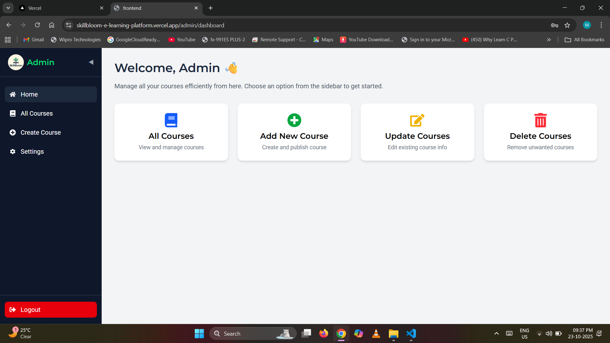

# SkillBloom – An E-Learning Platform

**SkillBloom** is a full-stack e-learning platform designed to make online learning secure, intuitive, and engaging.  
It provides an interactive environment for learners to browse, search, and purchase courses, and for admins to manage and publish them with ease.

## 🚀 Features Overview

### 👩‍💻 User Features
- 🔐 **User Authentication** (Login / Signup with JWT)  
- 🔎 **Search Courses** by title or description  
- 💸 **Buy Courses** (with a simulated success redirect)  
- 🎓 **My Courses Page** — view all purchased/enrolled courses  
- 💬 **Discount Display** — 20% OFF with animated “Limited Time Offer”  
- ⚙️ **Account Settings** — to update personal info and reset password  
- 📱 **Fully Responsive UI** — smooth experience on mobile, tablet, and desktop  

### 🧑‍🏫 Admin Features
- 🔐 **Admin Authentication** (separate login/signup)  
- 🧱 **Dashboard for managing courses**  
  - Add new courses (title, description, price, and image)  
  - Update or delete existing courses  
- ☁️ **Cloudinary Integration** for secure course image uploads  
- ⚙️ **Account Settings** to update personal info and reset password  
- 🧭 **Vercel SPA Routing** using `vercel.json`  
  - `/` → User App  
  - `/admin/login` → Admin App  

---

## 🧩 Tech Stack

| Layer            | Technology                                                                |
|------------------|---------------------------------------------------------------------------|
| 🎨 Frontend      | React.js, Tailwind CSS, Axios, React Router, React Icons                  |
| ⚙️ Backend       | Node.js, Express.js, MongoDB (Mongoose), JWT Authentication               |
| ☁️ Image Storage | Cloudinary                                                                |
| 🧭 Deployment    | Vercel (Frontend), Render (Backend), MongoDB Atlas (Database)             |

---

## 🧠 System Workflow

### 🧑‍🏫 Admin Side
1. Securely logs in via `/admin/login`.  
2. Creates, updates, or deletes courses.  
3. Manages course images directly on Cloudinary.  
4. Updates account details and changes password from the Settings Page.  

### 👩‍💻 User Side
1. Logs in / signs up securely.  
2. Browses courses with search functionality.  
3. Sees real-time discount display (e.g., “20% OFF”).  
4. Clicks **Buy Now** → Shows purchase success → Redirects to My Courses page.  
5. Updates personal info or password from Account Settings.  

---

## 🖼️ Screenshots

📌 **Project Overview**  
- Home 
 
- Courses
  
- Search
  

🎓 **Learning Journey**  
- Buy Page  

- Purchase Success
  
- My Courses  


🧑‍🏫 **Admin Dashboard**  
- Admin Login
  
- Dashboard  

- Create Course 
 
- Manage Courses  


⚙️ **Account Settings**  
- User Settings
  
- Admin Settings 
 

---

## ⚙️ Installation & Setup

### 1. Clone the Repository
```bash
git clone https://github.com/yourusername/skillbloom-e-learning-platform.git
cd skillbloom-e-learning-platform
```

### 2. Backend Setup
```bash
cd backend
npm install
```

Create a .env file inside the backend folder and add the following variables:
```
MONGO_URI=your_mongodb_connection_string
JWT_SECRET=your_jwt_secret
CLOUDINARY_CLOUD_NAME=your_cloudinary_name
CLOUDINARY_API_KEY=your_cloudinary_api_key
CLOUDINARY_API_SECRET=your_cloudinary_api_secret
PORT=your_port_number
```

Run the backend:
```bash
npm start
```

### 3. Frontend Setup
```bash
cd ../frontend
npm install
npm run dev
```

Add this file inside the frontend folder for single-page routing (vercel.json):
```
{
  "rewrites": [
    { "source": "/(.*)", "destination": "/" }
  ]
}
```

## 🌍 Deployment

| Component  |	 Platform      |
|------------|-----------------|
| Frontend   |  Vercel         |
| Backend    |  Render         |
| Database   |  MongoDB Atlas  |

Example URLs

- User App: https://skillbloom-e-learning-platform.vercel.app/
- Admin App: https://skillbloom-e-learning-platform.vercel.app/admin/login

## 🧭 Future Enhancements

- 💳 Integrate payment gateway (Razorpay / Stripe)
- 🧠 AI-based course recommendations
- ⭐ Ratings & reviews for courses
- 📊 Admin analytics dashboard
- 📞 OTP / Email verification system

## 👩 Author

Muskan Priya

🌐 Live Project: https://skillbloom-e-learning-platform.vercel.app/

## ⭐ Support

If you like this project, please give it a ⭐ on GitHub — it motivates me to improve and build more amazing projects!